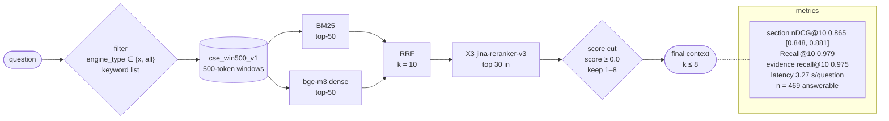

# X3-win500-gateoff-v3-7d629b5d

X3: H1 + keyword engine-type filter -> jina-reranker-v3 -> score cut · index `win500` · gate off · params `v3` · config `7d629b5dc623`

```mermaid
flowchart LR
  Q(["question"])
  FL{"filter<br/>engine_type ∈ {x, all}<br/>keyword list"}
  Q --> FL
  IX[("cse_win500_v1<br/>500-token windows")]
  FL --> IX
  S0["BM25<br/>top-50"]
  IX --> S0
  S1["bge-m3 dense<br/>top-50"]
  IX --> S1
  FU["RRF<br/>k = 10"]
  S0 --> FU
  S1 --> FU
  RR["X3 jina-reranker-v3<br/>top 30 in"]
  FU --> RR
  CT{"score cut<br/>score ≥ 0.0<br/>keep 1–8"}
  RR --> CT
  CTX(["final context<br/>k ≤ 8"])
  CT --> CTX
  subgraph M["metrics"]
    MP["section nDCG@10 0.865 [0.848, 0.881]<br/>Recall@10 0.979<br/>evidence recall@10 0.975<br/>latency 3.27 s/question<br/>n = 469 answerable"]
  end
  CTX -.- MP
```
